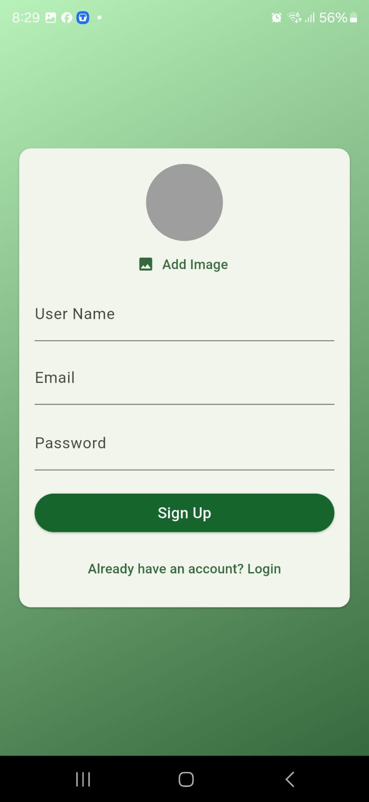
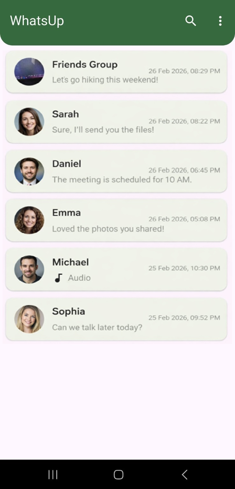
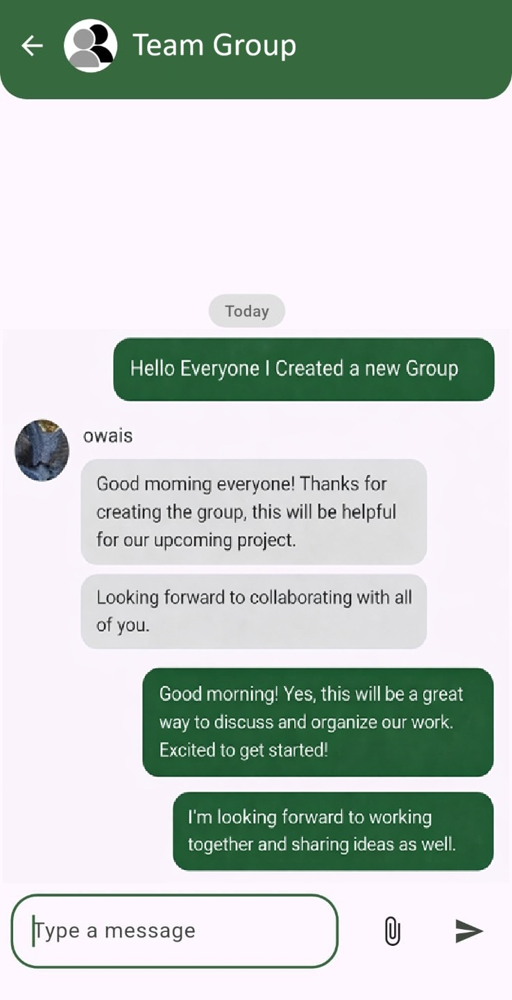
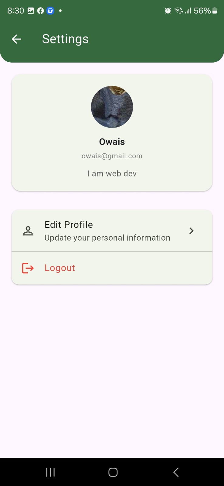

# WhatsUp - Flutter Chat & Calling App

## Overview
WhatsUp is a cross-platform mobile application built using Flutter that supports chat, audio/video calling, and real-time notifications.

## Features
- User Authentication
- Real-time Chat
- Audio & Video Calling
- Push Notifications
- Responsive UI
- Cross-platform (Android, iOS, Web)

## Technologies Used
- Flutter & Dart
- Firebase
- Agora SDK

## Screenshots

| Sign Up | Chat List | Group Chat | Settings |
|:-:|:-:|:-:|:-:|
|  |  |  |  |

## How to Run
1. Clone the repository
2. Api Setup: Rename copy_api_key.dart with api_key.dart and add you keys
3. Run: flutter pub get
4. Run: flutter run
